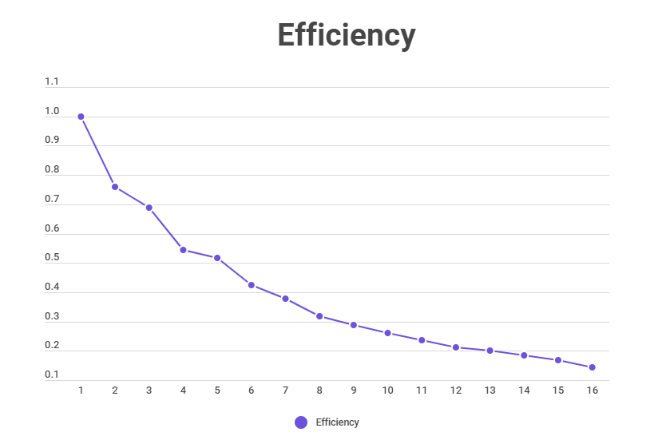
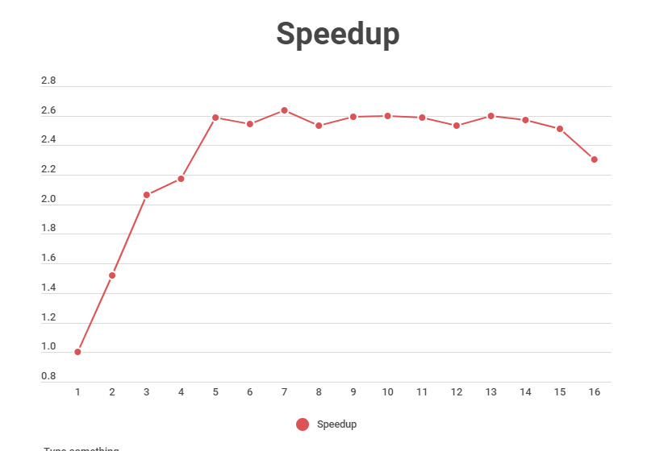

# PrimeNumbers

> Speedup and Efficiency calculation

## Objective 

The objective is to obtain the Speedup and the efficiency, 
executing the code from 1 to 16 threads, verifying if the 
numbers are prime or not from 2 to 100,000,000

## Observation For Results

* Bug: There is an error that causes tasks already carried 
out to be repeated multiple times.
* Collateral: due to the bug I have not been able to make 
the graphics correctly.
* Observation: do not consider tables with results this 28-10

## All Data Obtained 

| Threads | Time (milliseconds) | Speedup | Efficiency |
| --- | --- | --- | --- |
| 1   | 473284  | 1       | 1       |
| 2   | 311504  | 1.5193  | 0.7596  |
| 3   | 229340  | 2.0636  | 0.6878  |
| 4   | 217687  | 2.1741  | 0.5435  |
| 5   | 183001  | 2.5862  | 0.5172  |
| 6   | 186110  | 2.5430  | 0.4238  |
| 7   | 179451  | 2.6373  | 0.3767  |
| 8   | 186793  | 2.5337  | 0.3167  |
| 9   | 182643  | 2.5913  | 0.2879  |
| 10  | 182180  | 2.5978  | 0.2597  |
| 11  | 182878  | 2.5879  | 0.2352  |
| 12  | 186659  | 2.5355  | 0.2112  |
| 13  | 181957  | 2.6010  | 0.2000  | 
| 14  | 184052  | 2.5714  | 0.1836  |
| 15  | 188280  | 2.5137  | 0.1675  |
| 16  | 205305  | 2.3052  | 0.1440  |

## Efficiency Graph

 

## Speedup Graph

 

## License

This project is open-sourced software licensed under the [Apache License 2.0](https://www.apache.org/licenses/LICENSE-2.0)

## Contact

Created by Computer Engineer [Charlie Condorcet](https://github.com/charliecondorcet)